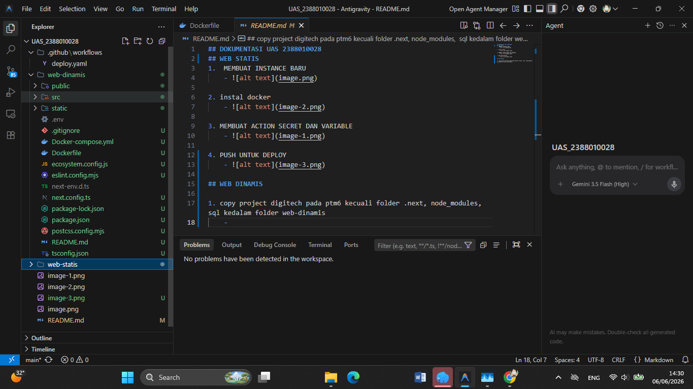
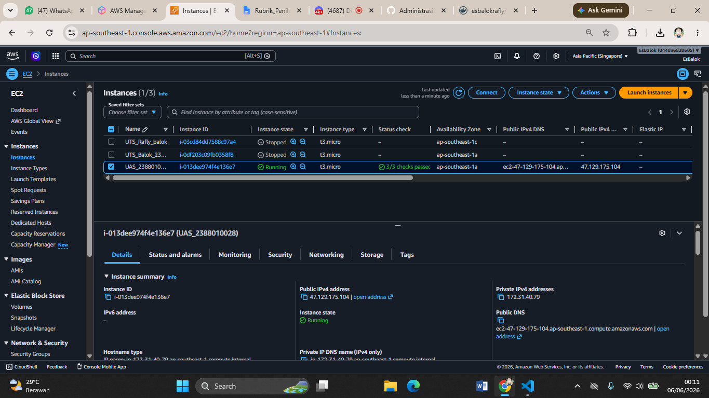
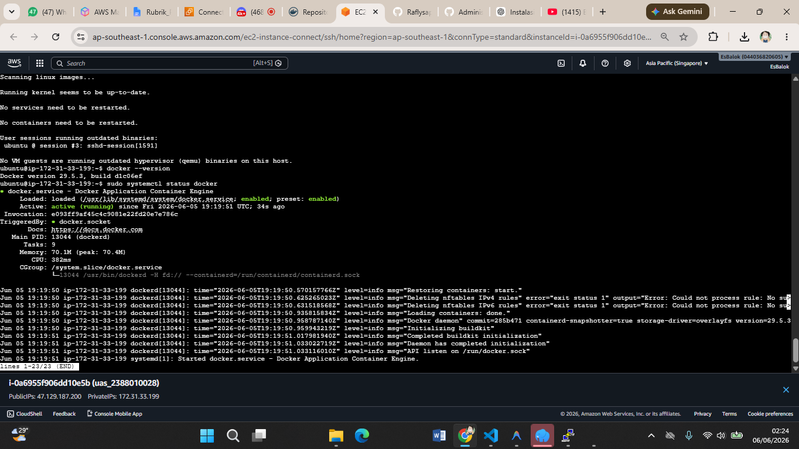
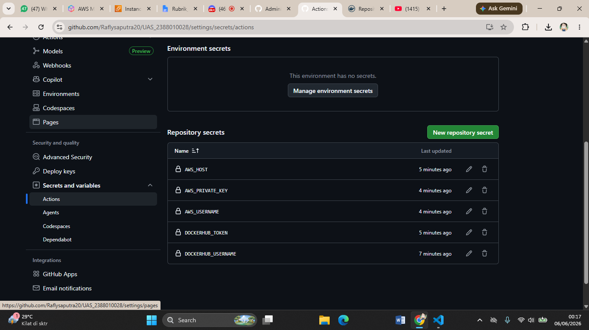
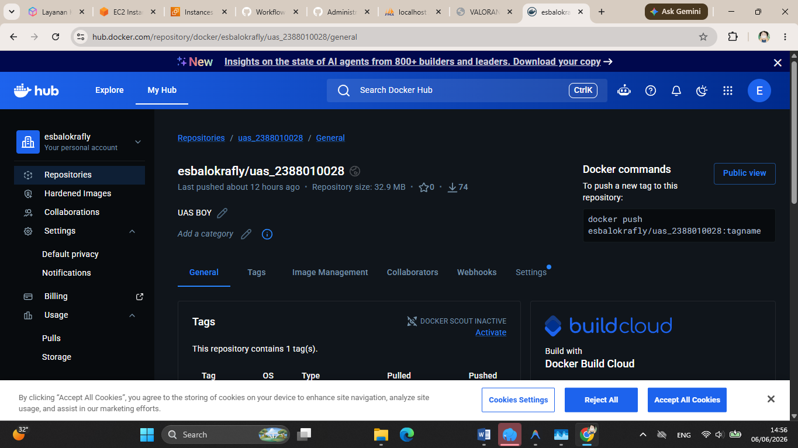
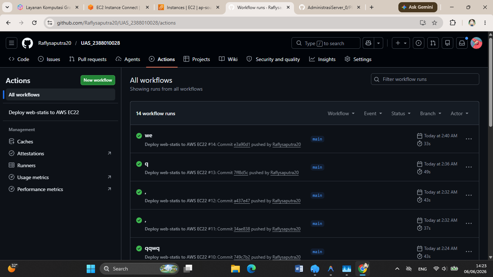
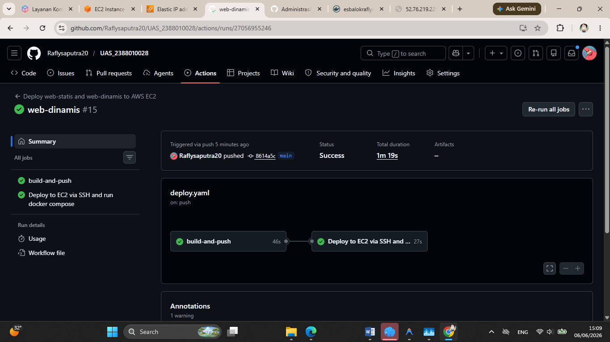
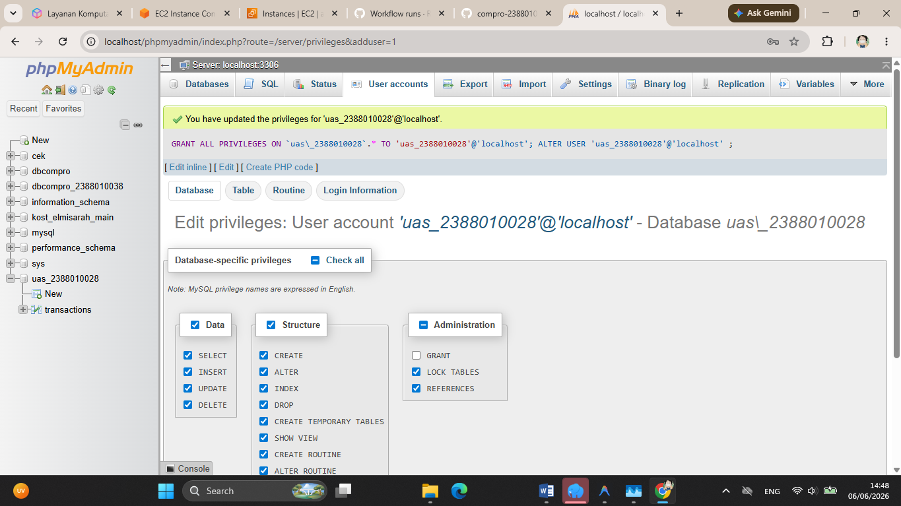
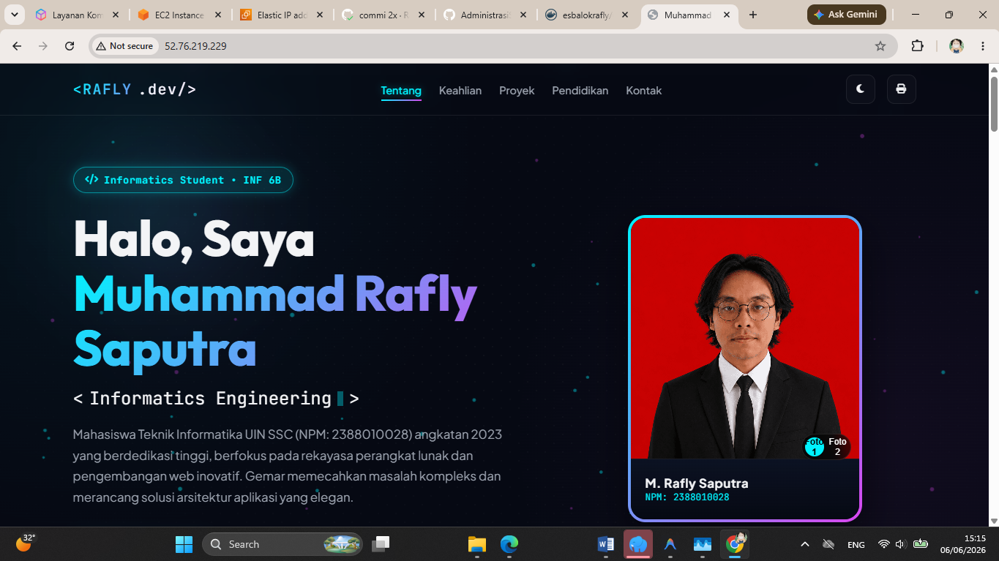
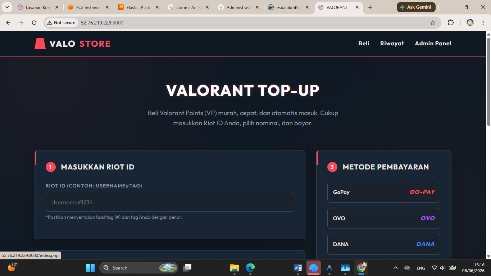

# 📑 DOKUMENTASI TEKNIS - DEPLOYMENT CLOUD & ORKESTRASI KONTANER
**UAS SISTEM TERDISTRIBUSI / CLOUD COMPUTING**

* **Nama Mahasiswa**: Muhammad Rafly Saputra  
* **NIM**: 2388010028  
* **Program Studi**: Informatika  
* **Repositori GitHub**: [Raflysaputra20/UAS_2388010028](https://github.com/Raflysaputra20/UAS_2388010028)

---

## 📋 PENDAHULUAN & ARSITEKTUR CI/CD

Dokumentasi ini dibuat untuk memenuhi seluruh Kriteria Penilaian (CPMK) tugas akhir UAS 2388010028. Proyek ini mengintegrasikan **Web Statis** (CV & Portofolio Informatika) dan **Web Dinamis** (Valorant Points Top-Up Store) ke dalam satu infrastruktur cloud di **AWS EC2** yang diorkestrasikan menggunakan **Docker Compose** dan dideploy secara otomatis melalui pipeline **GitHub Actions**.

### 🌐 Alur Arsitektur Deployment & CI/CD
1. **Push Trigger**: Setiap kali Developer melakukan `push` ke branch `main`, pipeline GitHub Actions dijalankan secara otomatis.
2. **Build & Push Images**: GitHub Runner login ke **Docker Hub** menggunakan token keamanan. Pipeline mengompilasi kode program menjadi dua Docker Image terpisah (`web-statis` dan `web-dinamis`), lalu mempublikasikannya ke repositori Docker Hub `esbalokrafly`.
3. **Deploy via SSH**: Pipeline menghubungi instans **AWS EC2** tujuan menggunakan protokol SSH.
4. **Orchestrate & Run**: Di dalam VM EC2, script deployment menulis file `docker-compose.yml` beserta skema inisialisasi database (`uas_2388010028.sql`), menarik image terbaru dari Docker Hub, lalu menjalankan seluruh service dalam mode background (`detached mode`).

### 📊 Diagram Arsitektur Sistem
```mermaid
graph TD
    Dev[Developer / Mahasiswa] -->|Git Push to main| GitHub[GitHub Repository]
    
    subgraph GitHub Actions Runner
        GitHub --> Work[Workflow deploy.yaml]
        Work --> BuildStatis[Build Nginx Web Statis]
        Work --> BuildDinamis[Build PHP-Apache Web Dinamis]
    end
    
    BuildStatis -->|Push Image| DockerHub[(Docker Hub Registry)]
    BuildDinamis -->|Push Image| DockerHub
    
    Work -->|SSH Remote Execution| EC2[AWS EC2 Instance Host]
    
    subgraph Docker Compose Orchestration (AWS EC2 VM)
        EC2 -->|Pull Images| DockerHub
        EC2 --> Nginx[container-statis Nginx:alpine]
        EC2 --> PHP[container-dinamis PHP:8.2-apache]
        EC2 --> DB[(db-webdinamis MariaDB:lts)]
        PHP -->|Koneksi DB Internal| DB
    end
    
    User([Penguji / Pengguna]) -->|HTTP Port 80| Nginx
    User -->|HTTP Port 3000| PHP
```

---

## 🛠️ ORKESTRASI DOCKER COMPOSE & JARINGAN

Manajemen multi-kontainer diatur secara deklaratif melalui Docker Compose di server AWS EC2, memastikan isolasi servis, konfigurasi jaringan internal, dan persistensi database terkonfigurasi dengan tepat.

### 📄 Konfigurasi docker-compose.yml
```yaml
version: '3.8'

services:
  db-webdinamis:
    image: mariadb:lts
    container_name: mysql-db
    environment:
      MARIADB_ROOT_PASSWORD: password!123
      MARIADB_DATABASE: uas_2388010028
      MARIADB_USER: uas_2388010028
      MARIADB_PASSWORD: 123456
    volumes:
      - db_data:/var/lib/mysql
      - ./db_data/uas_2388010028.sql:/docker-entrypoint-initdb.d/uas_2388010028.sql
    restart: always

  container-statis:
    image: esbalokrafly/uas_2388010028:latest
    container_name: compro-statis
    ports:
      - "80:80"
    restart: always

  container-dinamis:
    image: esbalokrafly/web-dinamis:latest
    container_name: compro-dinamis
    ports:
      - "3000:80"
    restart: always
    environment:
      DB_HOST: db-webdinamis
      DB_USER: uas_2388010028
      DB_PASSWORD: 123456
      DB_NAME: uas_2388010028
    depends_on:
      - db-webdinamis

volumes:
  db_data:
```

### 🔌 Analisis Port Mapping & Integrasi Jaringan (Network)
* **Web Statis (`container-statis`)**:
  Memetakan port internal container `80` (Nginx) ke port host `80`. Mengizinkan akses HTTP publik langsung tanpa menyertakan nomor port di URL.
  * *URL Akses*: `http://52.76.219.229/`
* **Web Dinamis (`container-dinamis`)**:
  Memetakan port internal container `80` (Apache Web Server) ke port host `3000`. Memisahkan lalu lintas aplikasi dinamis dari web statis.
  * *URL Akses*: `http://52.76.219.229:3000/`
* **Isolasi Database (`db-webdinamis`)**:
  Kontainer MariaDB sengaja **tidak mengekspos port ke luar** (tidak ada definisi `ports` pada `db-webdinamis`). Hal ini mencegah akses eksternal yang tidak sah ke port default `3306`.
* **DNS Resolving Internal**:
  Aplikasi PHP terhubung ke database dengan referensi `DB_HOST: db-webdinamis`. Docker engine secara otomatis melacak nama kontainer tersebut dalam default bridge network, sehingga komunikasi terjalin secara aman dalam lingkungan virtual terisolasi.

### 💾 Konfigurasi Volume & Persistensi Data
* Volume bernama `db_data` dipetakan ke direktori `/var/lib/mysql` di kontainer database. Skema ini memastikan bahwa semua perubahan tabel, transaksi pembelian, dan data log yang dimasukkan oleh pengguna bersifat permanen dan tidak hilang saat kontainer direstart (`docker compose down && docker compose up -d`).

---

## ⚡ FUNGSIONALITAS APLIKASI & AUTOMASI DATABASE

Aplikasi dirancang untuk berjalan secara independen dengan konfigurasi otomatis sejak pertama kali di-deploy (*Zero-Touch Setup*).

### 🏢 1. Fungsionalitas Aplikasi Web Statis
Aplikasi web statis merupakan halaman Curriculum Vitae (CV) & Portofolio Informatika interaktif milik mahasiswa yang dibangun dengan desain antarmuka modern (dark mode, glassmorphism) dan performa tinggi menggunakan web server **Nginx Alpine**.

### 🛍️ 2. Fungsionalitas Aplikasi Web Dinamis
Aplikasi web dinamis berbasis PHP 8.2 yang menyediakan platform top-up game **Valorant Points (VP)**. Aplikasi ini memungkinkan pengguna untuk melakukan simulasi pembelian points dengan Riot ID, melihat riwayat transaksi terbaru, serta menyediakan panel administrasi untuk mengelola paket dan memodifikasi status transaksi.

### 🗄️ 3. Mekanisme Automasi Database (2-Level Seeding)
Untuk menjamin database langsung ter-seeding secara otomatis saat dideploy, diimplementasikan pengamanan dua tingkat:
1. **Level Database (Init-Script Volume Mounting)**:
   File schema awal `uas_2388010028.sql` dimounting ke `/docker-entrypoint-initdb.d/uas_2388010028.sql`. Kontainer MariaDB akan otomatis mengeksekusi script ini saat inisialisasi awal database kosong untuk membuat tabel `transactions` dan menyisipkan 3 baris data transaksi dummy awal (`TenZ#NA1`, `Shroud#NA1`, dan `f0resT#EU1`).
2. **Level Aplikasi (Auto-Migration & Seeding PHP)**:
   Pada file runtime PHP (`db.php`), sistem akan mendeteksi keberadaan tabel `packages` dan `transactions`. Jika tabel hilang atau belum terbuat, PHP akan mengeksekusi query untuk membuat struktur tabel secara dinamis dan menyisipkan 6 paket default Valorant Points (120 VP hingga 8150 VP) agar aplikasi langsung siap digunakan.

---

## 🚀 LOG PENGUJIAN & ANALISIS ZERO DOWNTIME

### 🔄 Implementasi & Analisis Minimasi Downtime (Zero Downtime Approach)
Untuk meminimalkan *downtime* aplikasi selama rilis versi baru di server produksi, pipeline CI/CD diatur untuk mengeksekusi langkah-langkah berikut secara berurutan:
1. **Pre-pulling Images (`docker compose pull`)**:
   Docker Hub menarik image terbaru ke dalam disk lokal VM EC2 terlebih dahulu sementara kontainer lama masih berjalan melayani pengguna.
2. **Recreation (`docker compose down && docker compose up -d`)**:
   Kontainer lama dihentikan dan kontainer baru dijalankan dalam hitungan detik. Karena image sudah terunduh secara lokal, waktu re-kompilasi dan start-up servis menjadi sangat singkat (< 2 detik), meminimalisasi downtime aplikasi secara signifikan dibandingkan dengan proses build langsung di server.

---

## 📸 DOKUMENTASI VERIFIKASI PENGUJIAN (SCREENSHOTS)

Berikut adalah galeri bukti pengujian teknis yang memverifikasi keberhasilan dari setiap tahapan deployment:

### 1. Struktur Workspace & Proyek di IDE
* **Konfigurasi Workspace di Visual Studio Code (VS Code)**:
  Tampilan struktur direktori kerja proyek `UAS_2388010028` pada editor VS Code, memperlihatkan direktori `.github/workflows`, `web-statis`, `web-dinamis`, serta integrasi panel asisten AI.
  

### 2. Tahap Inisialisasi AWS EC2 & Instalasi Docker
* **Inisialisasi Virtual Machine AWS EC2**:
  Pembuatan VM Ubuntu Server 22.04 LTS baru di konsol AWS untuk bertindak sebagai server hosting aplikasi.
  
* **Instalasi Docker di Server Host VM**:
  Proses instalasi Docker Engine untuk mendukung eksekusi kontainer.
  

### 3. Konfigurasi CI/CD & Registry Docker Hub
* **Pembuatan Secrets Repository GitHub**:
  Pengaturan variabel environment sensitif (Host IP, SSH Private Key, Docker Token) secara terenkripsi pada repositori GitHub.
  
* **Registrasi Repositori Image di Docker Hub**:
  Pembuatan repositori registry image kontainer untuk menampung image hasil build pipeline.
  

### 4. Pipeline CI/CD & Proses Deployment
* **Eksekusi Sukses GitHub Actions Workflow (Push to Deploy)**:
  Log sukses otomatisasi kompilasi image, push registry, dan SSH deployment.
  
* **Proses Deploy di VM (SSH & Docker Compose Run)**:
  Eksekusi penarikan image dan jalannya Docker Compose di server EC2 yang diorkestrasikan oleh script deploy.
  

### 5. Verifikasi Database MariaDB
* **Automasi Database Seeding**:
  Verifikasi database `uas_2388010028` telah terbuat dan berisi tabel transaksi default melalui seeding otomatis.
  

### 6. Verifikasi Akses Port & Fungsionalitas Web
* **Akses Web Statis (Port 80)**:
  Halaman CV Interaktif berjalan sukses pada port default 80 di alamat IP Public EC2.
  
* **Akses Web Dinamis (Port 3000)**:
  Aplikasi top-up Valorant Points berjalan lancar dan terhubung sukses ke database.
  